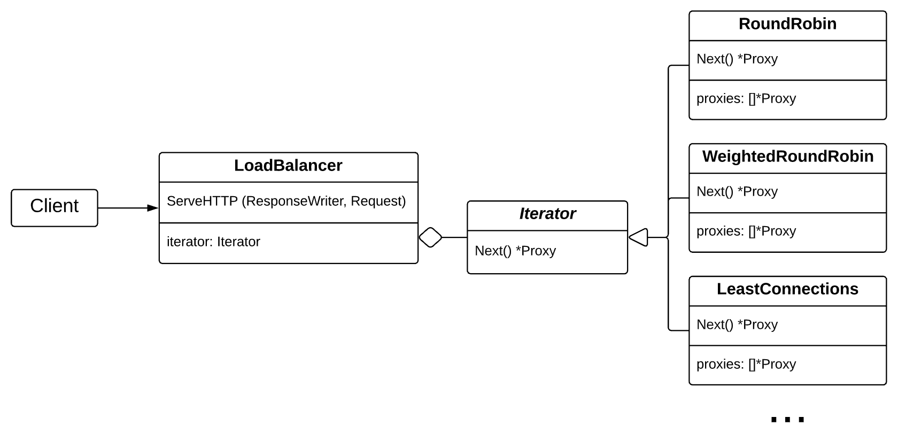

# Go Load Balancer

This module provides a simple load balancer implementation written in Go.

## Supported Algorithms

The load balancer supports the following load balancing algorithms:

- Round Robin
- Weighted Round Robin
- Random
- Least Connections

## Installation

To install `go-load-balancer`, use the following command:

    go get -u github.com/open-webtech/go-load-balancer

## Schema

The schema is kinda simplified, but the main idea is like that:



## Examples

### Round Robin

To demonstrate the Round Robin load balancing algorithm, let's create an instance and use it:

```golang
func main() {
	shortRespUrl, err := url.Parse("http://127.0.0.1:8081")
	if err != nil {
		log.Fatal(err)
	}
	p1 := proxy.NewProxy(shortRespUrl)

	longRespUrl, err := url.Parse("http://127.0.0.1:8082")
	if err != nil {
		log.Fatal(err)
	}
	p2 := proxy.NewProxy(longRespUrl)

	lb := loadbalancer.NewLoadBalancer(iterator.NewRoundRobin(p1, p2))
	log.Printf("load balancer started at port :8080")
	go func() {
		log.Fatal(http.ListenAndServe(":8080", lb))
	}()

	for i := 0; i < 5; i++ {
		func() {
			r, _ := http.Get("http://127.0.0.1:8080")
			b, _ := ioutil.ReadAll(r.Body)
			log.Printf("got %d resp: %s", i, string(b))
		}()
	}
}
```

**Output:**

```text
2019/12/04 11:59:23 load balancer started at port :8080
2019/12/04 11:59:24 got 0 resp: --- short resp ---
2019/12/04 11:59:24 got 1 resp: --------- long resp ---------
2019/12/04 11:59:24 got 2 resp: --- short resp ---
2019/12/04 11:59:24 got 3 resp: --------- long resp ---------
2019/12/04 11:59:24 got 4 resp: --- short resp ---
```

### Weighted Round Robin

The weighted round robin takes a mapping between proxies and their weights and distributes incoming requests between them depending on the weights.

```golang
func main() {
	// ...

	lb := loadbalancer.NewLoadBalancer(iterator.NewWeightedRoundRobin(map[*proxy.Proxy]int32{
		p1: 3,
		p2: 1,
	}))
	
	// ...
}
```

**Output:**

```text
2020/01/14 11:44:30 load balancer started at port :8080
2020/01/14 11:44:30 got 0 resp: --- short resp ---
2020/01/14 11:44:30 got 1 resp: --- short resp ---
2020/01/14 11:44:30 got 2 resp: --- short resp ---
2020/01/14 11:44:30 got 3 resp: --------- long resp ---------
2020/01/14 11:44:30 got 4 resp: --- short resp ---
```

### Random

The random load balancer, as its name implies, matches clients and servers randomly.
Its constructor accepts a function called `seed` to initialize the random number generator state.
To customize the state for debugging, use `rand.Seed(1)` for example.

```golang
func main() {
	// ...

	seed := func() {
		rand.Seed(time.Now().UTC().UnixNano())
	}
	lb := loadbalancer.NewLoadBalancer(iterator.NewRandom(seed, p1, p2))

	// ...
}
```

### Least Connections

The least connections load balancer chooses the least loaded available proxy to serve a request.

```golang
	// ...

	lb := loadbalancer.NewLoadBalancer(iterator.NewLeastConnections(p1, p2))

	// ...
```

## Acknowledgements

This project is a fork of [go-load-balancer](https://github.com/sotnikov-s/go-load-balancer) by [Sergio Sotnikov](https://github.com/sotnikov-s).
